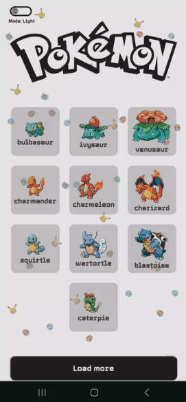

<h1> Pokemon Reseach</h1>

        

###  Tópicos:

- **_<a href="#descrição-do-projeto">Descrição do projeto</a>_**

- **_<a href="#funcionalidades-e-demonstrações-da-aplicação">Funcionalidades e Demonstrações da Aplicação</a>_**

- **_<a href="#ferramentas-e-técnicas-utilizadas">Ferramentas e Técnicas utilizadas</a>_**

- **_<a href="#acesso-ao-projeto">Acesso ao projeto</a>_**

- **_<a href="#abrir-e-rodar-o-projeto">Abrir e rodar o projeto</a>_**

<h2 id="descrição-do-projeto"> Descrição do projeto</h2>

Este projeto tem como objeto mostrar uma lista de pokémons da 1º Geração no intuito de saber as características e curiosidades do pokémon que o usuário estar procurando.

A pesquisa proporciona informações como o GIF do Pokémon, as características como o nome, tipo, os movimentos e habilidades com descrição do pokémon selecionado.
 

<h2 id="funcionalidades-e-demonstrações-da-aplicação"> Funcionalidades e Demonstrações da Aplicação</h2>

- **`Funcionalidade_1`**: Na página inicial temos uma lista de 10 Pokémons e logo abaixo contem um botão "Load More" para mostrar mais opções de pokémons:

    - **`Funcionalidade_1a`**: Abaixo do botão "Load More", há outra opção para o usuário escolher, que é mostrar uma lista de pokémons de acordo com o tipo:

- **`Funcionalidade_2`**: Acima no canto esquerdo temos um botão para alternarmos o tema do projeto para claro ou escuro:
    - Modo Claro: 

         
        

    - Modo Escuro: 

         
        

- **`Funcionalidade_3`**: Ao clicarmos em um pokémon abrimos uma página que mostra o pokémon e as suas características como o nome, tipo, movimentos e habilidades com descrição que esse pokémon possui:

    - **`Funcionalidade_3a`**: E por último, há um botão que tem o nome "Return" para podermos retornar à página principal:

<h2 id="ferramentas-e-técnicas-utilizadas"> Ferramentas e Técnicas utilizadas</h2>

- Este projeto foi construído com o React para que pudesse utilizar o conceito de Single Page Applications (SPA), que é criar um site com Aplicações de Página Única.

- Para buscar as informações dos pokémons foi preciso utilizar esta API: [*pokeapi.co*](https://pokeapi.co/).

- Utilizei o react-router-dom para navegar entre as páginas.

- Também foi utilizado o Context API para criar o Theme Toggler que serve para alternarmos o tema para claro ou escuro.

- O projeto foi totalmente estilizado com o styled-components, que serviu para deixar o site bonito, responsivo (utilizando o media query) e com um background animado (utilizando a propriedade animation).

<h2 id="acesso-ao-projeto"> Acesso ao projeto</h2>

<h2 id="abrir-e-rodar-o-projeto"> Abrir e rodar o projeto</h2>
